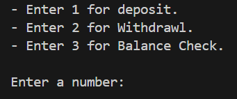
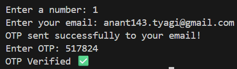
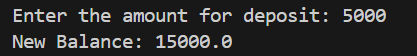
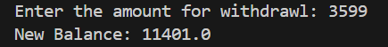
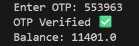

# OTP Banking System

A simple Python command-line banking simulation that uses **email-based OTP verification** for secure deposit, withdrawal, and balance checks. Built as a real-world practice project to demonstrate SMTP email integration, environment variable security, and basic transaction logic.

## 🛠️ Features

✔ Generates a 6-digit OTP  
✔ Sends OTP to user’s email using Gmail SMTP  
✔ Verifies OTP before allowing transactions  
✔ Supports:
- Deposit
- Withdrawal
- Balance check  
✔ Secure credential handling using `.env`

## 📋 Demo

Users are prompted with:

* Enter 1 for deposit.
* Enter 2 for Withdrawal.
* Enter 3 for Balance Check.

Example flow:
1. Enter your email
2. Receive OTP
3. Input OTP
4. Perform transaction

## 📸 Project Screenshots

### 🔹 Main Menu


### 🔹 OTP Sent & Verified


### 🔹 Deposit Transaction


### 🔹 Withdrawal Transaction


### 🔹 Balance Check



## 🚀 Getting Started

### 📦 Prerequisites

Install required Python library:

```bash
pip install python-dotenv
````

### 🔧 Setup

1. **Clone the repository**

```bash
git clone https://github.com/anant-tyagi143/otp-banking-system.git
```

2. **Create `.env` file**
   Inside the project root folder:

```
EMAIL=youremail@gmail.com
PASSWORD=your_gmail_app_password
```

3. **Run the program**

```bash
python main.py
```

## 🧠 How It Works

* `main.py` contains the CLI banking logic.
* `dotenv` loads sensitive credentials from `.env`.
* `smtplib` uses Gmail SMTP for OTP mail delivery.
* User must enter correct OTP before each transaction.

## 🛡 Security Notes

* Credentials are stored locally in `.env`.
* `.gitignore` excludes `.env` from GitHub.
* Gmail App Password (not your Gmail login) should be used.

## 📁 Project Structure

```
otp-banking-system/
│─ .env (ignored)
│─ .gitignore
│─ main.py
│─ screenshots/
```

## 🧩 Possible Future Enhancements

✔ OTP expiry timer
✔ Retry/lockout limits
✔ Logging attempts
✔ Convert to GUI or web app (Flask/Django)

## 📌 Contact

Developed by **Anant Tyagi** 👨‍💻
Follow: [https://github.com/anant-tyagi143](https://github.com/anant-tyagi143)


